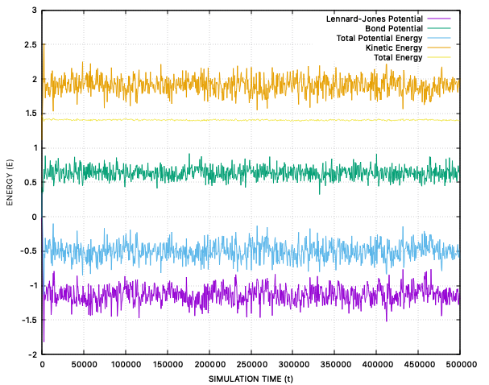
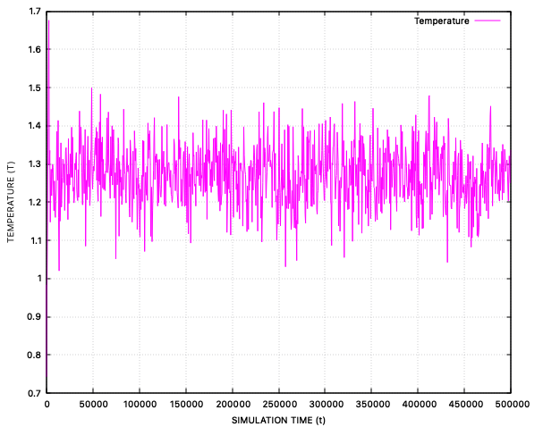
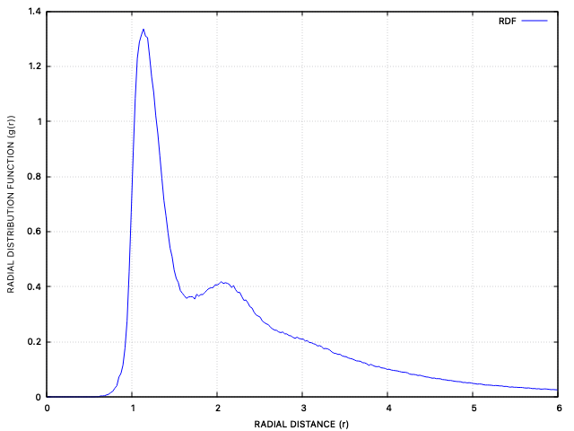
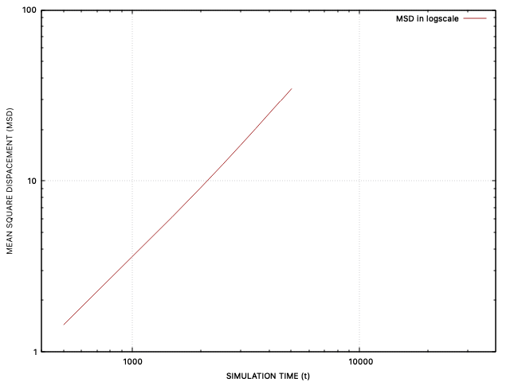
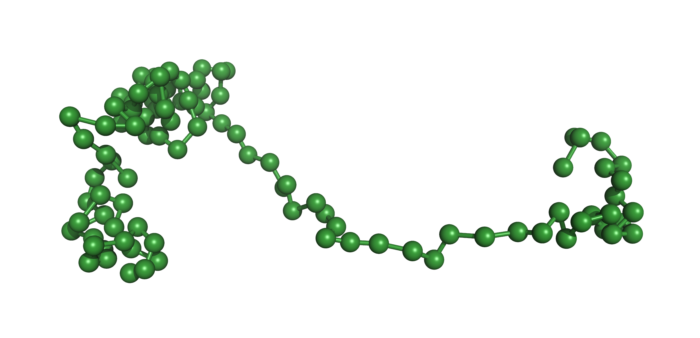
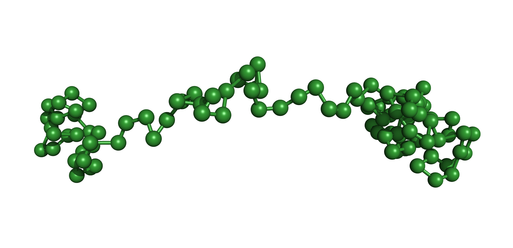
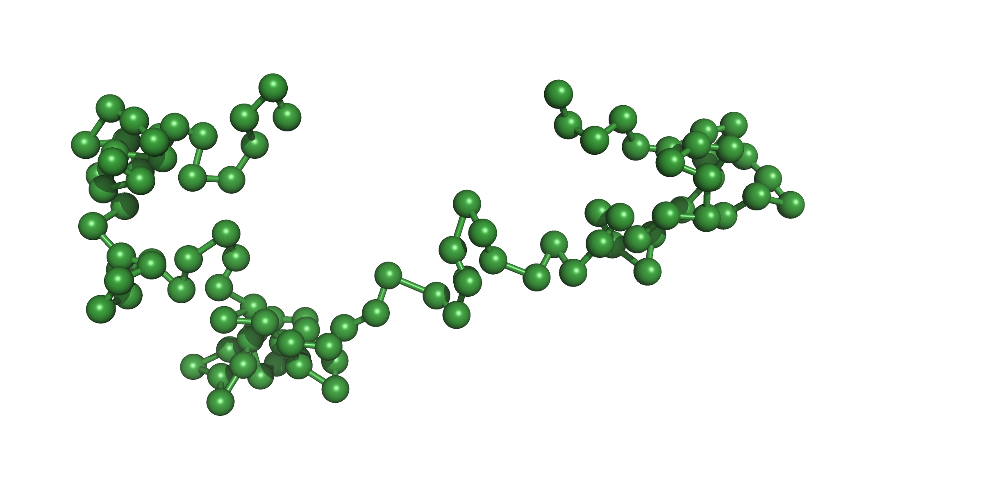
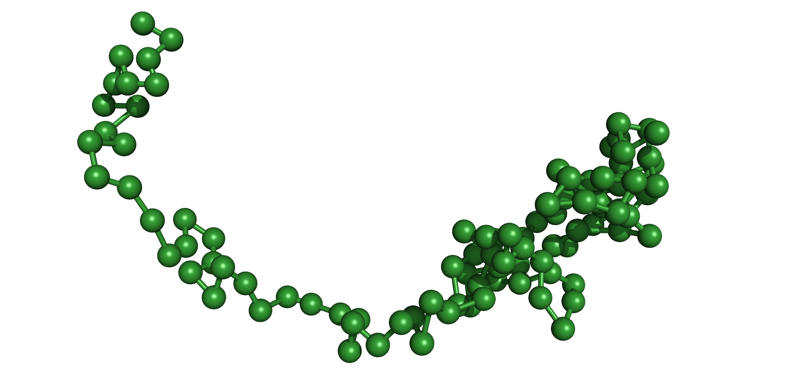
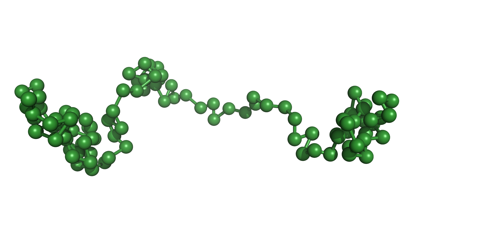
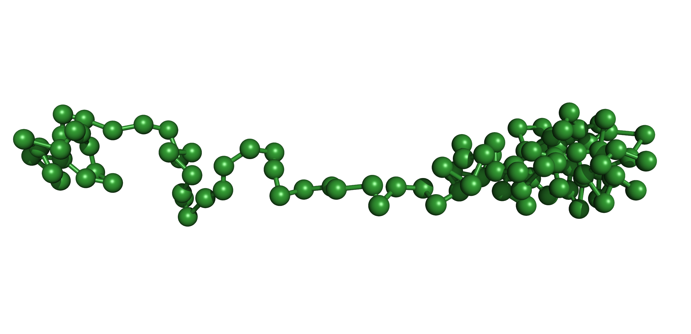

Here is the MD simulation code written in C to simulate a polymer chain that I made during my IAS SRFP Project 2024. The project was conducted under the guidance of Dr. Arnab Bhattacharjee at SCIS of JNU, New Delhi, India. 

_Note:_

[1] It is just an attempt and doesn't contains sofisticated thermostats or other crucial potentials necessary to completely replicate a polymer chain.

[2] After cloming the git, compile the [Makefile](Makefile) and run it using ./a.out

[3] For any issue, please contact me via. debarshibose100@gmail.com

---
## Abstract

Molecular Dynamics (MD) simulations are a crucial computational technique for investigating the dynamic behaviours and properties of biomolecular systems. During my project time period, I developed an MD simulation code which simulates the gaseous molecule, initially having a lattice-like structure. The developed code shows energy conservation, regenerating the gaseous radial distribution and diffusion as gaseous particles validated by mean square displacement following the periodic boundary condition in a cubic box. 

Further, I did a literature search on applying the isothermal condition using Langevin dynamics. In the extension of my work, I applied harmonic potential between adjacent molecules such that it can mimic a polymer chain, based on which my final analyses are made. The project was helpful for a better understanding of potential's physical significance which would be beneficial to understand the behaviour of complex biological systems far from equilibrium. This project underscores the role of MD simulations in advancing structural biology, revealing functional attributes based on dynamic structural changes and offering valuable insights for both basic and applied sciences.

---

## Methodologies

The initialisation of the system is done by positioning the particles on a cubic lattice, making sure that their cores don't overlap. The initial velocities of the particles are generated following a Maxwell–Boltzmann distribution, which would be distributed within a range of $[-0.05, 0.05]$. The velocities are then shifted in such a way as to maintain the thermal equilibrium of the system:

$$\langle v_{\alpha}^{2} \rangle = k_{B}T/m$$

The forces ($f$) applied on a system of particles created are used to update the position ($r$) of each particle and obtain their trajectories; the Verlet algorithm (modified for Langevin dynamics) is used. It is an algorithm whose solution is at par with Newtonian mechanics and involves a Taylor expansion and its approximation:

$$r_{n+1} \approx 2r_{n} - r_{n-1} + \frac{f}{m}\Delta t^{2}$$

$$v_{n} \approx \frac{(r_{n+1} - r_{n-1})}{2\Delta t}$$

In the simulation, only the velocities have been used to calculate the Kinetic Energy of the particles and thus the instantaneous temperature of the system.

Langevin equations could be integrated into the system in order to provide an implicit solvation to the set of particles:

$$F_{i} = M\Delta x/(\Delta t)^{2} + \gamma M\Delta x/\Delta t - 2k_{B}T\gamma M\,\eta(t)$$

Note that here $\eta(t)$ represents a random force which follows a Gaussian distribution and $\gamma$ represents the frictional coefficient.

Until this, a very basic system of particles has been created which would thus be modified to mimic some specific system. For this purpose, several potentials are applied to specifically modify the system. Based on the potentials applied, the forces are then updated.

**Lennard-Jones (LJ) Potential** is a short-range repulsive force that is applied to a particle pair, which are within a cut-off distance.

$$V_{LJ}(r) = 4\varepsilon\left[\left(\frac{\sigma}{r}\right)^{12} - \left(\frac{\sigma}{r}\right)^{6}\right]$$

This provides a volume for each particle from which other particles are kept excluded, hence termed "excluded volume". The computational cost is also minimised since LJ potential is only applied to selective particle pairs (those within the cutoff distance). The system at this stage resembles a group of non-bonded particles which would behave like those in a gaseous state.

**Bond potential** is a harmonic potential which is applied between each adjacent particle, to replicate the spring-like motion of the covalently bonded particles. Thus the particles are then provided with bonds and hence the system resembles that of a polymer. The initialization as done for this case involves arranging the particles in a linear fashion and then letting them evolve under the simulation conditions.

$$V_{bond}(r) = k_{bond}(r - r_{0})^{2}\,/\,2$$

Other types of potentials that could be added between bonded particles involve:

* **Bending potential** is applied to a system to restrict the movement of the angles of the particles in the chain within a certain range. Bend potential is also a harmonic potential which acts between three consecutive particles having two adjacent bonds, which governs the deviation of the angle ($\theta$) between those three particles from the initial angle ($\theta_{0}$).

  $$V_{bend}(\theta) = k_{bend}(\theta - \theta_{0})^{2}\,/\,2$$

* **Torsional potential** quantifies the energy associated with the rotation around a chemical bond. This energy is influenced by factors such as bond order, neighbouring atoms, and lone electron pairs. To accurately capture the complexities of torsional interactions, the potential is often represented as a Fourier series summation of multiple terms. It is a function of the dihedral angle ($\omega$), which is the angle between two planes defined by three consecutive atoms in a molecule.

  $$V_{torsion} = \frac{k_{torsion}}{2}\left[1 - \cos(n\omega - \gamma)\right]$$

  where $\gamma$ is the phase factor.

The force acting on each particle is thus computed based on these potentials, for all 3 dimensions.

**Periodic Boundary Conditions (PBC)** is applied to the system as it replicates the simulation box infinitely in all directions in order to eliminate surface effects, which can significantly distort the properties of a small system. This allows for the study of bulk properties, such as density, pressure, and diffusion coefficients, without the influence of artificial boundaries. In three dimensions, 26 nearest neighbours will thus be surrounding each box. 

In such a case, if a particle exits the box during the simulation time, its image particle will enter the box from the opposite side by maintaining the coordinates of the other axes. PBC is initially applied to individual particles of the system when the simulation is conducted for non-bonded particles and is removed after the polymer chain construction by application of the bond potential.

The system thus prepared is a microcanonical ensemble, for which we observe the energy fluctuation of the system as it evolves throughout the simulation time period. The system has a constant NVE (Particle-Volume-Energy), thus the total energy of the system is conserved.

---

## Results & Analysis

The system prepared for the simulation was analysed statistically. Several methods of analysis were undertaken to test the system's behaviour and hence the data and plots were generated accordingly.

The **Total Energy of the system** is the summation of all the potentials (P.E) applied to the particles and the kinetic energy (K.E) fluctuation due to changes in the velocities of the particles due to the application of the forces.

$$E_{total} = K.E + P.E$$

$$P.E = V_{LJ}(r) + V_{bond}(r)$$

_Fig 1. The energy graph is plotted for 100 bonded particles by considering the Potential
Energies due to Lennard-Jones potential & Bond potential; Kinetic Energy, and the Total
Energy of the system, for a duration of 500,000 simulation timestep._

With respect to simulation, the **Temperature of the system** is a representation of the change in the kinetic energy of the particles and is synchronous with it. The instantaneous temperature of the system fluctuates with that of the total kinetic energy.

$$k_{B}T(t) = \sum_{i=1}^{N} \frac{m_{i}v_{\alpha,i}^{2}(t)}{N_{f}}$$

where $k_{B}$ represents the Boltzmann constant and $T$ is the temperature of the system containing $N$ particles (with $N_f$ degrees of freedom), each with velocities $v_{i}$.

_Fig 2. Change in instantaneous temperature of the system plotted against the simulation
timestep of 500,000._

**Standard Deviation (SD)** is the variation of the data about their statistical mean. It is used here to observe the variation of the positions of the particles about the centre of mass of the system, during the course of the simulation. Low SD values indicate that there haven't been many deviations in the positions of the particles whereas high SD values indicate the opposite.

$$\langle \sigma_{i}(t) \rangle = \sqrt{\frac{\displaystyle\sum_{i} \langle (x_{i}(t) - \mu)^{2} \rangle}{N}}$$

$\sigma$ stands for the Standard Deviation calculated for $N$ number of particles, each having a position $x$ at time $t$, $\mu$ being the mean of all the positions at time $t$.

_Fig 3. SD plotted for 100 particles observed for a simulation timestep of 500,000._

The **Radial Distribution Function** $g(r)$ is used to find the probability of finding a particle, based on the distribution of particles in the system (number density), which varies with respect to a reference particle. The distance between a pair of particles plays a crucial role in the calculation of $g(r)$, which is then normalized relative to that of an ideal gas. This is highly crucial to validate the simulation with experiments since the $g(r)$ value can be obtained with light-scattering experiments.

$$g(r) = \frac{N}{V}\,4\pi r^{2}\,\Delta N$$

$N$ represents the number of particles, $V$ represents the volume of the system and $\Delta V$ represents the volume of the shell at the distance $r$.

_Fig 4. RDF or g(r) plotted for the particles in the system against the radial distance r._

**Diffusion** is a process whereby a set of particles gets uniformly distributed throughout the system over time. It is caused by the molecular motion of the particles in a solvent and is a product of the Brownian motion of the particles. As suggested by the relationship between diffusion coefficient and MSD derived by Einstein, the simplest way to quantitate it in a computer simulation is via calculating the ensemble average of the mean squared displacement of the particles:

$$\langle \Delta r(t)^{2} \rangle = \frac{1}{N}\sum_{i=1}^{N} \Delta r_{i}(t)^{2}$$

$N$ is the number of particles in the system with $\Delta r$ the change in position of each particle over time $t$.

_Fig 5. MSD for particles obtained and plotted in log scale against simulation timesteps._

**Structure visualization** was done using Pymol Software. The initial position of each bead was assigned such that it represented a linear filament, and snapshots were taken as the system evolved.

t = 0 

t = 30800

t = 62600

t = 208000 

t = 326200

t = 428200 

t = 495400

_Fig 6. Snapshots of the filament containing 100 bonded beads, under simulation for
500,000 timesteps (t)._

---

## Tools & Softwares

With the conceptualization mentioned beforehand, this code was generated in-house using the **C programming language**. It is a procedural programming language which consists of several functions and procedures to solve a problem.

Preparing the simulation by coding gives a much added benefit over the usage of the software as it provides flexibility, customization, and a much deeper understanding of the underlying algorithms. It allows us to tailor simulations to specific needs, optimize performance for unique systems, and implement novel methodologies. Such an approach enhances the ability to troubleshoot and modify the simulation, which is often limited when using pre-built software.

**Gnuplot** (Version 6.0 patchlevel 1) was used for plotting the graphs from the data obtained from the simulations, thus allowing for the analysis of the results. It is a command-line and GUI (Graphical User Interface) program that can generate two and three-dimensional plots of functions, data, and data fits.

**Pymol** (Version 3.0.0), a molecular structure visualization software, was used for the visual representation and analysis of the snapshots of the system with the evolving time. Two types of files were generated using the code, which involves a `.pdb` file containing the coordinates of the particles, which were updated at several equispaced time points throughout the simulation, and a `.pml` file containing the information about the bonds between the particles. These files were loaded in Pymol for visual analysis purposes.

---

## Conclusion

Many biological processes occur far from equilibrium, such as protein folding, enzyme activity, and the functioning of molecular motors. MD simulations can capture the conformational changes and interactions in these systems as they undergo dynamic transitions. This technique is thus in demand for structural and computational biologists in recent years. MD simulations provide a dynamic perspective of the static view of biomacromolecules, thereby unravelling many functional attributes based on structural changes.

In this project, I understood the process from scratch by developing a simplified model to mimic a polymer chain and validating it with experimentally available data. By implementing these simulations, I could observe molecular systems' dynamic behaviour and properties, providing insights into their functional roles and interactions.

This system could be further developed by changing the energy landscape of the system in a specific way so that the system could be made to be in high resemblance with that of active matter.

Simulating molecular dynamics allows researchers to predict the time-dependent behaviour and response of systems in thermodynamically non-equilibrium conditions evolving towards equilibrium. This has significant implications for understanding the fundamental processes in biology and developing applications in medicine and materials science. The project demonstrated the potential of MD simulations in offering a detailed, dynamic view of biomolecular systems, highlighting their importance in contemporary biological research.
